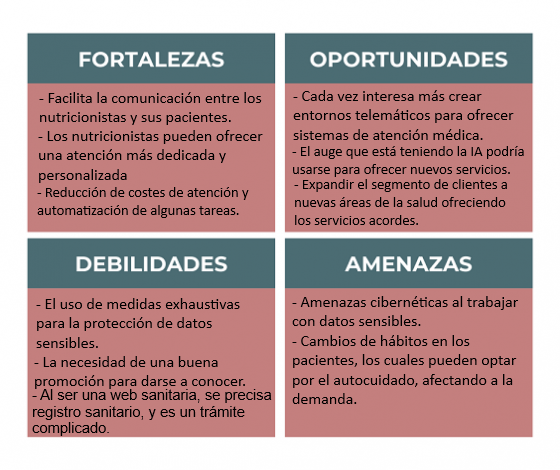
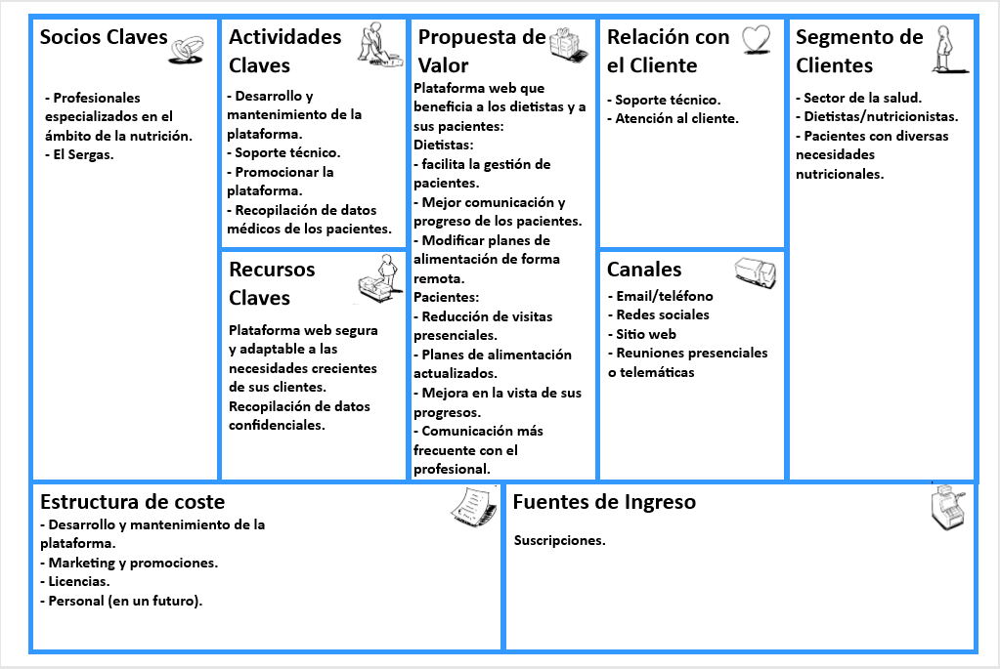

# Anteproxecto fin de ciclo

- [Anteproxecto fin de ciclo](#anteproxecto-fin-de-ciclo)
  - [1- Descrición do proxecto](#1--descrición-do-proxecto)
  - [2- Empresa](#2--empresa)
    - [2.1- Idea de negocio](#21--idea-de-negocio)
    - [2.2- Xustificación da idea](#22--xustificación-da-idea)
      - [Análisis DAFO](#análisis-dafo)
      - [Modelo canvas](#modelo-canvas)
    - [2.3- Segmento de clientes](#23--segmento-de-clientes)
    - [2.4- Competencia](#24--competencia)
    - [2.5- Proposta de valor](#25--proposta-de-valor)
    - [2.6- Forma xurídica](#26--forma-xurídica)
    - [2.7- Investimentos](#27--investimentos)
      - [2.7.1- Custos](#271--custos)
        - [Custos fixos](#custos-fixos)
        - [Custos variables](#custos-variables)
      - [2.7.2- Ingresos](#272--ingresos)
    - [2.8- Viabilidade](#28--viabilidade)
      - [2.8.1- Viabilidade técnica](#281--viabilidade-técnica)
      - [2.8.2 - Viabilidade económica](#282---viabilidade-económica)
      - [2.8.3- Conclusión](#283--conclusión)
  - [Prevención de riscos laborais (interesante no caso da miña idea de negocio)](#prevención-de-riscos-laborais-interesante-no-caso-da-miña-idea-de-negocio)
      - [Medidas preventivas](#medidas-preventivas)
  - [4- Requirimentos técnicos](#4--requirimentos-técnicos)
  - [7- Planificación](#7--planificación)
      - [Calendario de organización de fases do proxecto:](#calendario-de-organización-de-fases-do-proxecto)

## 1- Descrición do proxecto

O proxecto tratará de crear unha páxina web para un/unha dietista e os seus pacientes.
Contará con dúas interfaces: a do profesional e a do paciente. 
A finalidade do proxecto é proporcionar unha plataforma web na que o obxectivo sería mellorar a comunicación e a xestión do profesional sanitario co seu paciente, sendo capaces de actualizar os datos con regularidade sen ter consultas presenciais de todas as veces, levar un seguemento activo de cada uns dos pacientes dos que dispón o/a dietista, cambiarlle o tratamento ou as dietas vendo os resultados do paciente... 
Preténdese polo tanto reducir as visitas presenciais cos profesionais, ao poder comunicarse e ver o progreso de cada paciente. Ademáis de modernizar o método de traballo do profesional neste campo da nutrición e da dietética.
Pese a que xa existen aplicacións de nutrición, hai unha minoría delas que establecen unha relación directa entre médico e paciente, e que lle permiten ao/á dietista levar un seguimento tan preciso. 
A idea sería ser capaz de comercializala no ámbito sanitario público galego, xa que ofrece un novo medio de comunicación e de traballo que non se está aproveitando actualmente e que podería facilitar moitos trámites. 

Uso das linguaxes: HTML, CSS, JavaScript e PHP.
Prototipo realizado con Figma.
Comunicación asíncrona con AJAX.
Uso de bases de datos MySQL - phpMyAdmin.

## 2- Empresa

### 2.1- Idea de negocio

A idea trata de mellorar a comunicación entre un profesional sanitario (neste caso un nutricionista ou dietista) e os seus distintos pacientes.
O producto polo tanto é a plataforma web que conecta ao nutricionista e os seus clientes, no que o profesional pode visualizar os seus pacientes e administralos pola súa conta, unha organización das súas citas e pode enviar mensaxes.
O cliente pode actualizar os seus datos, como o e-mail, o seu teléfono ou a súa dirección.
O valor engadido desta idea de negocio é que o nutricionista ten a posibilidade de poder compartir ficheiros de interés individualmente para cada un dos seus pacientes, estes poden abrilos e descargalos.
Ademáis o paciente pode levar un rexistro do seu peso, e o nutricionista pode acceder a esta información mediante unha gráfica na que se traducirían estes datos.

A utilidade da que goza esta idea é ofrecer unha mellor organización e seguemento para o profesional sanitario a parte de modernizar a súa forma de traballo. Para o paciente reduciríanse os inconvenientes das visitas aos centros sanitarios, que conlevan tempo, gastos de transporte e faltas de asistencia.

### 2.2- Xustificación da idea

A idea do proxecto xurdiu dun problema persoal, xa que no último ano por temas de saúde estiven moito en contacto con distintos médicos e profesionais. Por ese motivo perdín moito tempo e entre outras cousas aumentaron as miñas faltas de asistencia a clase. Polo tanto, a idea parte da miña necesidade de intentar solventar esa pérdida de tempo en consultas a centros de saúde ou hospitales, sabendo que hai a posibilidade de crear un medio de comunicación virtualizado e modernizado que pode reemplazar encontros presenciais por outros medios telemáticos que son igual de efectivos e che permiten aforrar o tempo de presentarte persoalmente nos distintos complexos sanitarios.  

Pola parte do profesional, as necesidades que se pretenden satisfacer son: Unha mellor organización e visualización do traballo, unha mellor comunicación e seguemento co seu paciente e a capacidade para ofrecer un mellor servizo, más personalizado.

Na actualidade existen en España varias plataformas web que son utilizadas no ámbito sanitario privado, como Docline, Selene e Doctoralia, entre outras. Pero no ámbito público non se está a utilizar ningunha plataforma web que conecte os pacientes cos seus médicos.
#### Análisis DAFO

#### Modelo canvas

### 2.3- Segmento de clientes

Esta idea de negocio vai dirixido inicialmente aos nutricionistas individuais.

En España, o número de colexiados na área do nutricionismo é de 5.698, e en Galicia e de 148. (datos do ano 2020 recollidos do IGE e do INE)

Nun futuro a idea sería ampliar a plataforma a outras áreas da saúde para abarcar un maior número de clientes, que pasaría a ser de 301.684, xa que é o número de médicos colexiados en España (datos sacados do INE do ano 2023). 

Polo tanto, os clientes serían os nutricionistas e nun futuro os médicos doutras áreas sanitarias e os usuarios serían os pacientes destes profesionais sanitarios.

### 2.4- Competencia

- Identificación da competencia, as súas características e a súa posición no mercado.
Existen xa varias plataformas de nutrición moi parecidas á idea, algunhas delas son:
MyFitnessPal, Lifesum e Cronometer. Estas tres aplicacións poñen a disposición do seu usuario ferramentas para levar un plan de alimentación, exercicios e hábitos saudábeis.

Despois temos as empresas Docline, Selene e Doctoralia. 
Docline caracterízase por realizar consultas médicas utilizando videoconferencias ou chats, Selene permite acceder á historia clínica de cada paciente e xestionar medicamentos, Doctoralia permite aos pacientes encontrar médicos, concertar citas e leer opinións de outros pacientes.
Estas tres últimas conforman unha competencia moito máis directa, pero o que se pretende coa idea deste proxecto é unificar todas esas características individuais de cada unha das anteriores empresas, para desenvolver un servicio completo e de acordo ás necesidades dos profesionais e dos pacientes.

- Existencia de productos/servizos substitutivos.
Algúns productos sustitutivos poderían ser as consultas presenciais que existen na actualidade, xa que sobre todo para a xente maior ou que non esté moi familiarizada co mundo do internet e da tecnoloxía, será o método máis cómodo e que seguirán utilizando.
A cantidade de foros e sitios webs que aportan información sobre como mellorar a calidade de alimentación e dan consellos sobre nutrición. A desventaxa destes sitios e que ás veces se contradicen e a información que dan non é precisa.

### 2.5- Proposta de valor

O que pretende esta idea a parte de unificar as funcionalidades doutras empresas xa existentes, e proporcionar unha plataforma máis sinxela para o seu uso, económica e con un soporte técnico de calidade.

Unha funcionalidade futura que aforraría gastos e tempo sería a implementación dun chatbot, a súa principal función sería responder a preguntas frecuentes, o que evitaría que usuarios teñan que mandar formularios e tarden en recibir unha resposta.

Un obxectivo futuro desta empresa é abarcar máis usuarios, incluíndo funcionalidades específicas para cubrir necesidades de médicos doutros ámbitos da saúde. Dependendo da especialización do médico, este terá determinadas ferramentas que lle serán útiles na súa actividade profesional.

Dende o lado do cliente (profesionais médicos), mellórase a eficiencia e a productividade e o acceso aos datos, proporcionando ademáis unha seguridade para á protección destes en casos de intento de roubo ou perda.
Pola outra banda, mellórase a experiencia de atención ao paciente e redúcense pérdidas de tempo e costes de transporte, polo que aumenta a súa satisfacción

### 2.6- Forma xurídica
A forma xurídica que mellor se adapata á empresa no comezo da súa actividade empresarial é a de autónomo, ao estar constituída por unha soa persoa.
Ademáis os trámites son rápidos e máis económicos en comparación a outras formas xurídicas, e non é necesario aportar un capital inicial. 
Tribútase polo IRPF, que é un imposto progresivo que ten en conta as ganancias para establecer o porcentaxe a pagar, no que ao principio pode ser beneficioso, xa que o normal é non obter demasiados beneficios nos primeiros anos.

Sen embargo, se a empresa se expande e aumentan as súas ganancias, podería ser interesante cambiar a forma xurídica a unha Sociedade Limitada Unipersonal (se só houbera un socio) ou unha Sociedade Limitada. Xa que os impostos a pagar son sempre os mesmos e a súa responsabilidade é limitada, xa que se debe aportar un capital inicial de mínimo 3000 €.

### 2.7- Investimentos

- Equipo informático 1300 €
- Licencia de software (Windows 11) 150 €
- Servizo de hosting 10 €

#### 2.7.1- Custos

##### Custos fixos

- Licencia de software 150 € ao ano 
- Hosting 10 €/mes -> 120 € ao ano
- Cuota mínima mensual da Seguridade Social -> cuota cero
- Salario 1323 €/mes -> 15876€ ao ano

##### Custos variables 

- Marketing 200 €/mes -> 2400 € ao ano
- IVA  21%
- IRPF 
  
Total mensual = 1346 + 200 = 1546 €
Total anual = 16146 + 2400 = 18546 €

#### 2.7.2- Ingresos
O modelo de negocio que vai seguir a empresa é o de suscripción mensual, xa que así os ingresos son máis recurrentes e predecibles, polo tanto facilita a elaboración dun posible plan financieiro ou de inversións. Ademáis de poder proporcionarlle ao cliente un período de proba no que poderá decidir se os servicios que se ofrecen se adaptan debidamente ás súas necesidades.

ANO 1 
Suscripción mensual -> 25 € 
Para cubrir todos os gastos mensuais, teríanse que vender 62 suscripcións ao mes para non estar nunha situación de perdas.
Estímase que no primeiro ano os ingresos mensuais sexan de 625 € (25 suscripcións vendidas ao mes) -> Total de ingresos: 7500 € no primeiro ano

ANO 2 
Suscripción mensual -> 25 €
O que se pretende e manter o precio e atraer a máis clientela.
Ingresos mensuais ->  1250 € (50 suscripcións vendidas ao mes) -> Total de ingresos: 15000€ no segundo ano

ANO 3
Suscripción mensual -> 30 €
Sube o precio xa que se pretende mellorar a experiencia dos seus usuarios implementando novas funcionalidades e obtendo feedback dos clientes.
Ingresos mensuais -> Total de ingresos: 2400 € (80 suscripcións vendidas ao mes) -> 28000 € no terceiro ano

ANO 4 
Suscripción mensual -> 30 €
Mantense o prezo para garantizar estabilidade aos pacientes.
Ingresos mensuais -> 3000 € (100 suscripcións vendidas ao mes) -> Total de ingresos: 36000 € no cuarto ano

### 2.8- Viabilidade

#### 2.8.1- Viabilidade técnica

 A creación dunha páxina web non ten a necesidade de dispoñer de grandes instalacións e materias primas. A única máquina que facerá falta será o ordenador, e o resto dos recursos serán a conexión a internet e dispoñer de electricidade.

O que podería pasar no proceso de creación da páxina web é que ao implementar unha funcionalidade, esta non funcione correctamente, xa sexa pola súa dificultade, ou pola existencia doutras funcionalidades xa implementadas e haxa problemas de compatibilidade ou que interfiran entre sí. 

#### 2.8.2 - Viabilidade económica

Nos primeiros anos, será case imposible obter algún beneficio, xa que é unha empresa nova que se introduce no mercado, e terá que primeiro darse a coñecer para obter clientela.

Polo calculado o primeiro ano:
Se a suscripción se vende a 25€ e se pretenden vender 25 ao mes, os ingresos serían de 7500€. 
Nun ano, os custos fixos e variables calculados son de 18546€, polo que estaríamos a 11046€ de alcanzar o umbral de rentabilidade.  

Os cálculos do segundo ano seguindo os datos calculados:
Mantense o prezo, tamén se espera aumentar o número de clientes e vender 50 suscripcións ao mes, sendo o total de ingresos obtidos de 15000€. 
Os ingresos seguen sendo inferiores aos costes, pero a distancia ao umbral de rentabilidade é menor que no primeiro ano:  15000 - 18546 = -3546 € (Beneficio negativo)

Cálculos do terceiro ano:
Aumenta o prezo xa que se pretenden desenvolver e mellorar funcionalidades e ofrecer un mellor servizo ao cliente.
Preténdense vender 80 suscripcións ao mes a 30€ cada unha. O total de ingresos nese ano ascenderían a 28000€ e alcanzaríanse uns beneficios positivos de 9454€ (umbral de rentabilidade positivo).

Según o calculado no cuarto ano:
Mantense o precio da suscripción e preténdese que aumenten as vendas, vendendo 100 suscripcións ao mes e obtendo uns ingresos de 36000€ e uns beneficios de 17454€.

#### 2.8.3- Conclusión

Os primeiros anos, como na maioría das empresas que empezan unha actividade laboral, realízanse investimentos que non se poderán amortizar nos primeiros anos, e tamén os custos serán superiores aos ingresos obtidos. 
Sen embargo unha actividade importante e que axudaría moito no crecemento económico da empresa sería unha boa promoción para darse a coñecer, e se fose posible captar a atención de inversores e conseguir financiamento. 
Por outra parte, é un mercado que non está demasiado explotado e as oportunidades de crecemento son altas, a parte de que sendo un emprendedor xoven, hai a posibilidade de obter axudas e financiación beneficiosa de valiosa axuda, a parte de apoiarse en fondos propios. Algúns deles son:
Líneas de financiación ICO
Subvención polo establecemento como traballador autónomo ou por conta propia. (máximo de 9000 €)
Microcréditos do Ministerio de Igualdade (programa PAEM): Micro financiación de ata 25000 € a mulleres que pensen en crear a súa propia empresa. 

## Prevención de riscos laborais (interesante no caso da miña idea de negocio) 

- #### Riscos
 - Posibilidade de ser hackeado.
 - Perda de datos do desenvolvemento web.
 - Erros no desenvolvemento ou despregamento.
 - Accidentes por desorde ou verteduras de líquidos na zona de traballo.
 - Posibles lesións musculoesqueléticas por mala postura, danos oculares. 
 #### Medidas preventivas
 - Uso de contrasinais seguros.
 - Manter o software actualizado e ter antivirus.
 - Facer copias de seguridade e gardar o código de desenvolvemento nun repositorio.
 - Manter sempre o espazo de traballo limpo e ordenado, e ter coidado cos líquidos que poidan entrar en contacto cun cable ou ordenador e danar o ambiente de traballo.
 - Emprego de cadeiras ergonómicas, boa postura ao estar sentado, manter as pantallas a certa distancia, ter unha boa iluminación, facer breves descansos e estiramentos durante o tempo de traballo, utilizar lentes con filtro azul para protexer a vista.

## 4- Requirimentos técnicos

- **Infraestructura:** software libre XAMPP, servidor web Apache, máquina virtual con software Windows 10.
- **Backend:**  linguaxe de programación PHP, Base de datos MySQL --> phpmyAdmin.
- **Frontend:** Figma, HTML, CSS, JavaScript: swiper.js, chart.js, comunicación asíncrona con AJAX.

## 7- Planificación

#### Calendario de organización de fases do proxecto:
 

